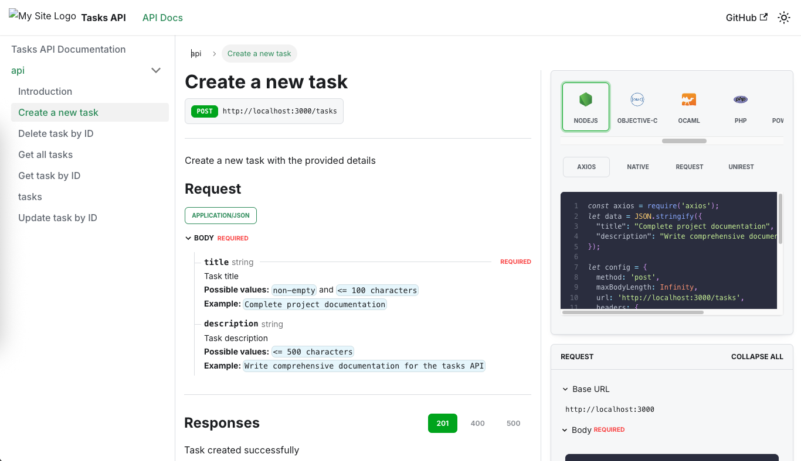

<p align="center">
  <a href="http://nestjs.com/" target="blank"></a>
</p>

# POC: NestJS + Docusaurus para Documentação Automática de API

## Descrição

API REST simples para gerenciamento de tarefas/todos construída com o framework [Nest](https://github.com/nestjs/nest). Esta é uma Prova de Conceito (POC) que demonstra a integração entre NestJS e Docusaurus para gerar documentação automática a partir das especificações OpenAPI/Swagger.

## Objetivo da POC

Esta POC visa demonstrar:
1. Implementação de uma API REST com NestJS
2. Geração automática de documentação com Docusaurus e plugin OpenAPI
3. Base para implementação futura de GitHub Actions para atualização automática da documentação

## Endpoints da API de exemplo

- `GET /tasks` - Listar todas as tarefas
- `GET /tasks/:id` - Buscar tarefa por ID
- `POST /tasks` - Criar uma nova tarefa
- `PUT /tasks/:id` - Atualizar tarefa por ID
- `DELETE /tasks/:id` - Excluir tarefa por ID

## Configuração do Projeto

```bash
npm install
```

## Compilar e Executar o Projeto

```bash
npm run start
```

### Configuração da Documentação

1. Instalar dependências da documentação:
```bash
npm install
```

2. Gerar documentação da API a partir da especificação OpenAPI:
```bash
npm run gen-api-docs
```

3. Iniciar o site de documentação:
```bash
npm start
```

A documentação estará disponível em `http://localhost:3000`.

### Exemplo da Documentação Gerada

Abaixo está um exemplo da documentação gerada automaticamente pelo Docusaurus com o plugin OpenAPI, mostrando a interface para criar uma nova tarefa:



A imagem acima demonstra como a especificação OpenAPI é transformada em uma documentação interativa com:
- Detalhes do endpoint e método HTTP
- Exemplos de payload e parâmetros necessários
- Campos obrigatórios e tipos de dados
- Exemplos de código para realizar requisições
- Possíveis respostas da API

### Comandos da Documentação

- `npm start` - Iniciar o servidor de desenvolvimento da documentação
- `npm run build` - Construir a documentação para produção
- `npm run gen-api-docs` - Gerar documentação da API a partir da especificação OpenAPI
- `npm run clean-api-docs` - Limpar documentação da API gerada

### Atualizando a Documentação da API

A documentação da API é gerada automaticamente a partir da especificação OpenAPI localizada em `openapi/tasks-api.yaml`. Para atualizar a documentação:

1. Desenvolva normalmente o código usando Swagger decorators no NestJS
2. Execute `npm run gen-api-docs` para regenerar a documentação
3. As alterações serão refletidas no site de documentação

### Plano Futuro: GitHub Actions para Atualização Automática

Um dos objetivos futuros desta POC é implementar uma GitHub Action que:

1. Detecte alterações na API (controllers, DTOs, entities) com um trigger de Pull Request
2. Atualize automaticamente o arquivo de especificação OpenAPI
3. Regenere a documentação do Docusaurus
4. Faça deploy da documentação atualizada

Isso garantirá que a documentação esteja sempre sincronizada com a implementação atual da API, eliminando a necessidade de atualização manual.
